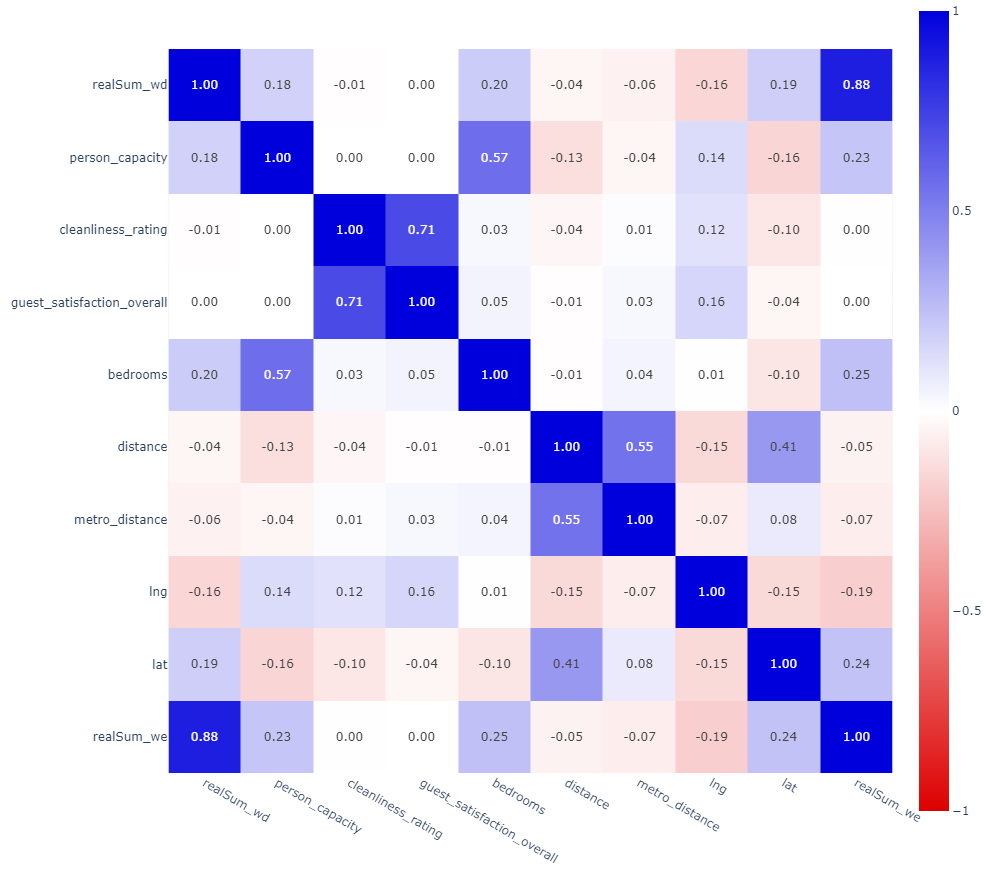
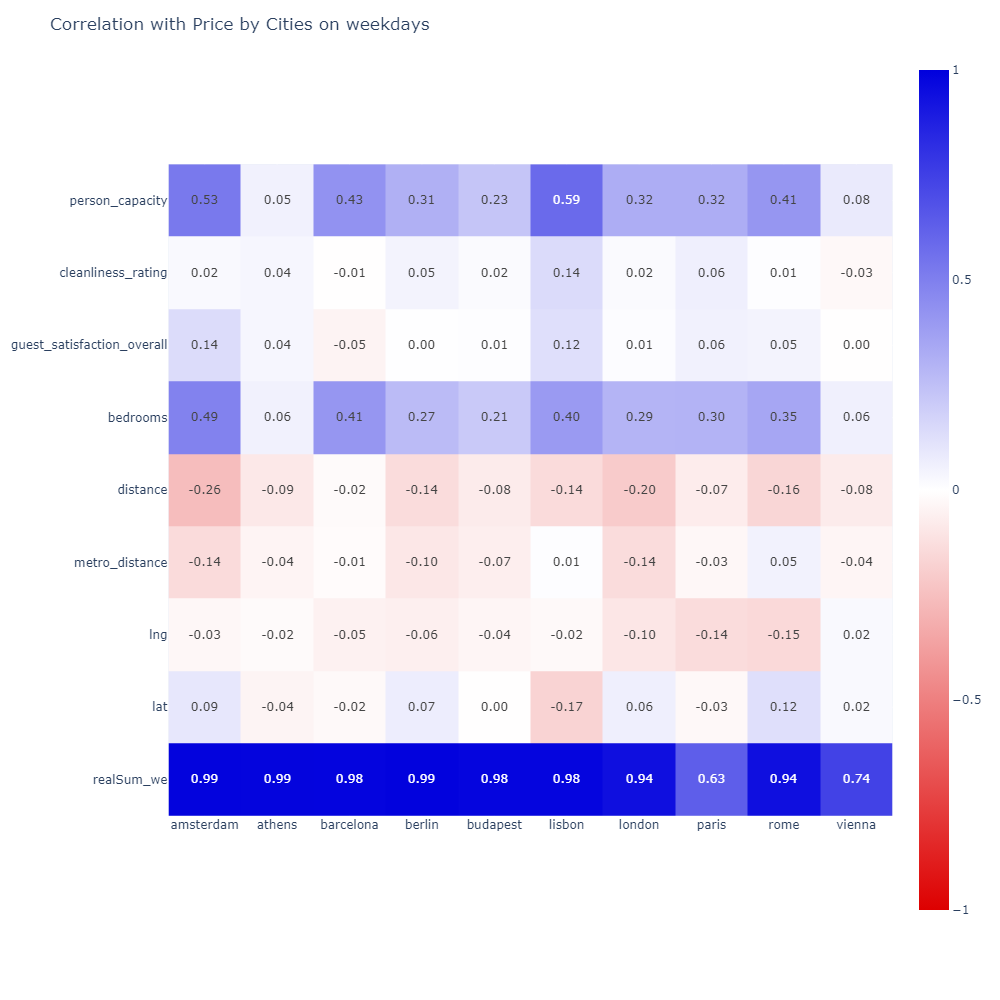
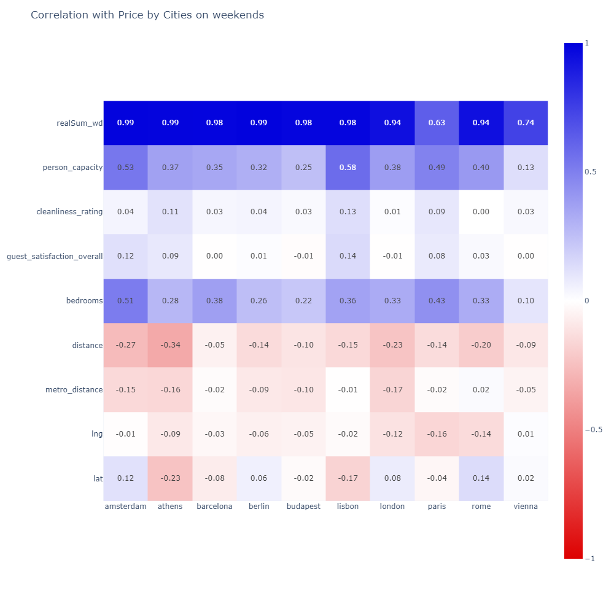

### PET- проект  
### на тему: **Аналіз цін на Airbnb у 10 містах Європи в будні і вихідні дні, а також визначення факторів, які впливають на рівень цін**  


### **Опис проєкту**  

Мій PET-проєкт спрямований на розуміння впливу  різних факторів як наприклад: кількість кімнат, ліжок чи відстань до центру та інших на ціну на Airbnb в різних містах Європи в і залежності чи бронювання здійснюється на будні дні чи на вихідні.  

Моя робота буде орієнтована на вивчення взаємозв'язків  між різними факторами та ціною у будні і в вихідні в різних містах Європи. Дослідження планується провести в цілому і в розрізі міст.  

**Моя мета** – дослідити вплив різних факторів на ціну, щоб даний аналіз міг бути використаний для формування ціни власниками помешкань, які планують здавати їх в оренду через сервіс Airbnb.  

### **Вибір технологій та стеку**
* **Google BigQuery та SQL:** SQL планується використовувати для роботи з базою даних та здійснення потрібних запитів.
* **Python:** Планується використати Python разом з бібліотеками pandas, Matplotlib та Seaborn для більш детального аналізу даних і иявлення кореляціії між ціною та факторами, що потенційно можуть на неї впливати.
* **Tableau:** Для створення візуалізацій та дашбордів для кращого візуального представлення результатів.

### **Збір та очищення даних**  
Для аналізу було вибрано дат-сет з [Kaggle](https://www.kaggle.com/datasets/thedevastator/airbnb-prices-in-european-cities/data) В дата-сеті було 20 таблиць - по 2 таблиці на кожне місто - з цінами в будні і вихідні дня. Спочатку я дослідила вміст таблиць і стовпчиків у  Google BigQuery за допомогою SQL-запитів. Оскільки в даних таблицях не було ключів і в Google BigQuery не підтримує складені ключі, то було прийнято рішення використати Python для обробки даних. В Python за допомогою складеного ключа я заватажила і об'єднала таблиці наступним чином:  

```
import pandas as pd
def merge_data(cities_names):
    all_data = []
    for city in cities_names:
        weekdays = pd.read_csv(f'{city}_weekdays.csv') 
        weekends = pd.read_csv(f'{city}_weekends.csv') 
        
        merged_city = pd.merge(weekdays, weekends, how='outer', on=['room_type', 'room_shared', 'room_private',
        'person_capacity', 'host_is_superhost', 'multi', 'biz', 'cleanliness_rating', 'guest_satisfaction_overall',
        'bedrooms', 'lng', 'lat'])
        merged_city['city'] = city
        all_data.append(merged_city)
    
    cities_data = pd.concat(all_data, ignore_index=True)
    return cities_data

cities_names = ['amsterdam', 'athens', 'barcelona', 'berlin', 'budapest', 'lisbon', 'london', 'paris', 'rome', 'vienna']
cities_data = merge_data(cities_names)
```

Оскільки у нас була проблема з тим, що через різні округлення у нас не збігілись колонки по відстані до центру і метро, то замість 2 стовпців робимо 1 спільний:

```
import numpy as np
cities_data['dist_x'] = cities_data['dist_x'].replace('NaN', np.nan)
cities_data['dist_y'] = cities_data['dist_y'].replace('NaN', np.nan)

cities_data['distance'] = cities_data['dist_x'].fillna(cities_data['dist_y'])

cities_data['metro_dist_x'] = cities_data['metro_dist_x'].replace('NaN', np.nan)
cities_data['metro_dist_y'] = cities_data['metro_dist_y'].replace('NaN', np.nan)

cities_data['metro_distance'] = cities_data['metro_dist_x'].fillna(cities_data['metro_dist_y'])
```

Видаляємо зайві стовпці з таблиці:

```
cities_data  = cities_data.drop(["Unnamed: 0_x", "Unnamed: 0_y", "dist_x", "metro_dist_x", "dist_y", "metro_dist_y"], axis=1)
```

Також, щоб прискорити процес обробки даних, видаляємо стовпці, які не плануємо використовувати в даному дослідженні: attr_index, attr_index_norm, rest_index та rest_index_norm.

```
cities_data  = cities_data.drop(["attr_index_y", "attr_index_norm_y", " rest_index_y", "rest_index_norm_y", "attr_index_x",
"attr_index_norm_x", " rest_index_x", "rest_index_norm_x"], axis=1)
```

Перейменовуємо деякі стовпці з таблиці, щоб було зрозуміло, які стовпці відносятьмся до інформації в цілому по локації, тільки по будням і тільки по вихідним.
Для будніх додамо в кінці назви "_wd", для вихідних "_we".

```
cities_data.columns = cities_data.columns.str.replace("_x", "_wd")
cities_data.columns = cities_data.columns.str.replace("_y", "_we")
```

Переглядаємо чи коректні типи даних в наших таблицях:

```
cities_data.info()
```

Замість окремих булевих стовпчиків, зробимо стовпчки з варіантами типу бізнесу по кількості помешка і стовпець, в якому буде вказано чи локація доступна лише в будні, лише в вихідні чи в будь-які дні:

```
cities_data['biz_type'] = cities_data.apply(    
    lambda row: 'multi' if row['multi'] == 1 else ('biz' if row['biz'] == 1 else 'one'), axis=1)

cities_data['booking_days'] = cities_data.apply(    
    lambda row: 'weekends only' if pd.isna(row['realSum_wd']) else ('weekdays only' if pd.isna(row['realSum_we'])
    else 'any day'), axis=1)
```

Зробимо агрегацію даних - подивимось скільки яких типів помешкань серед наших локацій:

```
room_types = cities_data.groupby('room_type')['room_type'].count()
```

Як можна побачити, що стовпці  room_shared і  room_private по суті дублюють уже зазначену в room_type інформацію. Тому видаляємо ці стовпці з таблиці і виведемо таблицю, щоб побачити результат:

```
cities_data  = cities_data.drop(["multi", "biz", "room_shared", "room_private"], axis=1)
cities_data
```

Як, бачимо ми отримали таблицю з 15 колонками і 33 312 рядочками, і ці дані надалі знадобляться нам в аналізі.

### **Аналіз даних**  
Аналіз даних почнемо з кореляції, яку також зробимо в Python.  
Спочатку проаналізуємо кореляцію між різними факторами. Для цього виберемо, фактори, які будемо включати до нашого кореляційного аналізу і потім зробимо безпосередньо кореляційний аналіз:

```
factors=['realSum_wd','person_capacity','cleanliness_rating','guest_satisfaction_overall','bedrooms','distance',
'metro_distance','lng','lat', 'realSum_we']
correl = cities_data[factors].corr()
```

Результатом буде таблиця, але оскільки вона складна для сприйняття, то ми зробимо візуалізацію з використанням кольорів, щоб полегшити срийняття інформації:

import matplotlib.pyplot as plt
import seaborn as sns
import plotly.express as px

```
fig = px.imshow(correl, zmin = -1, zmax = 1, color_continuous_scale = ['#DD0000','#FFFFFF','#0000DD'],
title="Correlation", width=1000, height=1000, text_auto ='.2f')
fig.show()
```

Отримаємо таку картинку:



Як бачимо, сильний кореляційний зв'язок є між ціною в будні і в вихідні, і між оцінкою чистоти та рівнем загального задоволення помешканням.  
Середній кореляційний зв'язок у нас є між кількістю спалень і кількістю осіб, які можуть орендувати помешкання, а також між відстанню до центра та широтою, хоча це очевидно є випадковим збігом.  
Між рештою показників кореляційний зв'язок слабкий.  
Далі більш детально зупинимось на цінах в різних містах і подивимось на кореляцію між ціною в будні і різними факторами, а також між ціною в вихідні і різними факторами.  

Почнемо з дослідження кореляції між ціною в будні і різними факторами:

```
m = pd.DataFrame()

for city in cities_data.city.unique():
    file = (cities_data [cities_data.city == city][factors].corrwith(cities_data [cities_data.city == city]['realSum_wd']))
    m = pd.concat([m,file], axis = 1)

m.columns = cities_data.city.unique()

fig = px.imshow(m[1:], zmin = -1, zmax = 1, color_continuous_scale = ['#DD0000','#FFFFFF','#0000DD'], width=1000, height=1000, text_auto = '.2f')
fig.update_layout(title = "Correlation with Price by Cities on weekdays")
fig.show()
```

Отримаємо таку картинку:  



Як бачимо, сильний кореляційний зв'язок цін в будні з цінами в будні в усіх містах, крім Парижу, там він средній.  
Також в багатьох містах середній кореляційний зв'язок цін в будні з кількістю кімнат (Амстердам, Барселона, Лісабон і Рим) і кількістю людей, яких можна розмістити в помешканні (Амстердам, Барселона, Лісабон і Рим).  
По решті показників кореляційний зв'язок слабкий.  

Розрахуємо кореляцію між ціною в будні і різними факторами:  

```
m1 = pd.DataFrame()

for city in cities_data.city.unique():
    city_data = cities_data[cities_data.city == city]
    

    columns_to_corr = [col for col in factors if col != 'realSum_we']
    
    file1 = city_data[columns_to_corr].corrwith(city_data['realSum_we'])
    m1 = pd.concat([m1, file1], axis=1)

m1.columns = cities_data.city.unique()

fig = px.imshow(m1, zmin=-1, zmax=1, color_continuous_scale=['#DD0000','#FFFFFF','#0000DD'], width=1000, height=1000, text_auto='.2f')
fig.update_layout(title="Correlation with Price by Cities on weekends")
plt.savefig('Correlation with Price by Cities on weekends.png')
fig.show()
```

Кореляція між ціною в вихідні і різними факторами виглядатиме наступним чином:



Як бачимо, у нас виходить аналогічно з буднями, що є сильний кореляційний зв'язок цін в будні з цінами в вихідні в усіх містах, крім Парижу, там він средній.  
Також в багатьох містах середній  кореляційний зв'язок цін в будні з кількістю кімнат (Амстердам, Барселона, Лісабон і Рим, але тут ще додаються Афіни, Лондон і Париж) і кількістю людей, яких можна розмістити в помешканні (Амстердам, Барселона, Лісабон і Рим, але тут ще також додаються Лондон і Париж).  
По решті показників кореляційний зв'язок слабкий.  

